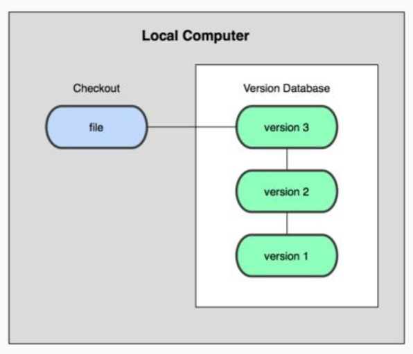
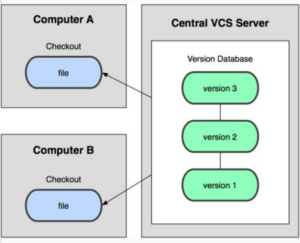
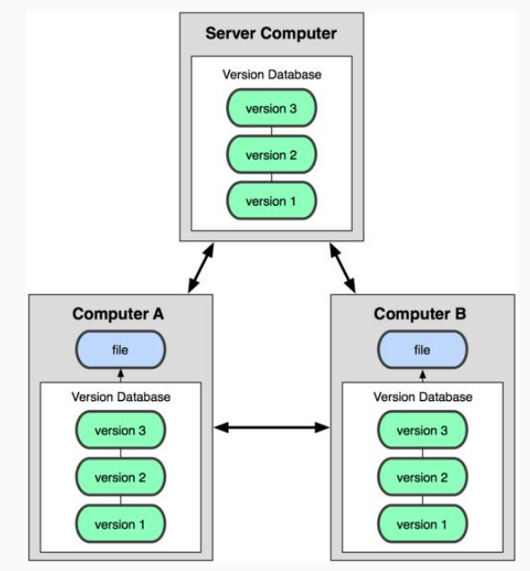

# ¿Qué es PHP?

PHP es un lenguaje de programación de propósito general de alto nivel que fue diseñado especialmente para el desarrollo de aplicaciones web.

Es interpretado, multiplataforma, open source, el cual ha sido muy popular en los últimos años.

## ¿Qué NO es PHP?

* No es un lenguaje compilado, por lo cual siempre tendrás que llevar juntos tu código y tu interprete.
* No esta diseñado para realizar aplicaciones de escritorio.

Para trabajar con PHP instalaremos un entorno de desarrollo llamado XAMPP, no es un entorno pensado para producción.

# Sintaxis de PHP

Hagamos el ejemplo más sencillo para trabajar con PHP. Siempre que usemos PHP usaremos lo siguiente: todo lo que pongamos dentro de esto será lo que el servidor va a interpretar como código php, lo que esté fuera lo ignorará.

Para acceder a él lo haremos localhost:8080/hello.php porque el servidor abre por defecto el archivo index y nuestro nuevo archivo se llama hello.php.

Si queremos escribir código php en nuestra vista HTML tendremos que cambiarle la extensión al archivo por .php porque nuestro servidor esta configurado a solo interpretar archivos PHP. Solo las partes dentro de van a ser interpretadas y su código fuente no será visible desde el navegador.

Todas las sentencias de código se separarán con un ; (punto y coma).

# Variables, tipos de datos y cadenas

Una variable puede ser una pequeña cajita en la que puedes almacenar un valor y este lo pueden usar para realizar alguna operación.

Para declararla usaremos el símbolo de $ y en seguida el nombre, este puede ser un _ o una letra.

PHP no es estáticamente tipado, es decir que no tenemos que decirle qué tipo de dato es esa variable. Además, es débilmente tipado porque podemos fácilmente cambiar el tipo de dato, es decir PHP ejecuta una conversión de datos interna.

Al momento de trabajar con PHP una cosa muy importante es hacer debugging a nuestras variables, para ello utilizamos la función var_dump(); pasándole por parámetro la variable a revisar.

En PHP tenemos dos tipos de cadenas, las que son con comillas simples y las de comillas dobles. La diferencia entre estas dos cadenas es que la de comillas simples recibe de forma literal lo que le escribas mientras que la de comillas dobles intenta interpretar cualquier variable dentro de ella.

# Tipos de Datos en PHP

PHP cuenta con muchos tipos de datos, sin embargo, en este momento nos vamos a enfocar en los más importantes y utilizados que son boolean, integer, float, string, array y NULL.

## Tipos escalares:

* boolean:

Representa solamente un valor verdadero o falso. 
[http://php.net/manual/es/language.types.boolean.php](http://php.net/manual/es/language.types.boolean.php)
Valores válidos: true (verdadero) false (falso)

```
<?php
$a = true;
$b = false; 
?>
```

* Integer:

Representa un número entero positivo, negativo o 0. 
[http://php.net/manual/es/language.types.integer.php](http://php.net/manual/es/language.types.integer.php)

```
<?php
$a = -123;
$b = 0;
$c = 7763;
?>
```

* float o double:

Representa un número de punto flotante, existen problemas de precisión con los números flotantes debido a la naturaleza binaria de las computadoras. 
[http://php.net/manual/es/language.types.float.php](http://php.net/manual/es/language.types.float.php)

```
<?php
$a = 12.24; 
$b = 1.5e3; 
$c = 7E-10;
?>
```

* string:

– Representa una cadena de caracteres.
– Existen 4 formas de representar una cadena. Las 2 principales son usando comillas simples o comillas dobles.
---- Usando comillas simples donde el texto será exactamente como se escribe.
---- Usando comillas dobles permite usar caracteres de escape y además expanden los nombres de las variables, es decir sustituye el valor de las variables dentro de las cadenas.

– Hay 2 formas adicionales llamadas Heredoc y Nowdoc que sirven para crear cadenas de múltiples líneas.

Si quieres conocer más de este tipo de dato da [click aquí](http://php.net/manual/es/language.types.string.php#language.types.string.details).

## Tipos compuestos

* array:

Representa una colección de valores, aunque por defecto PHP usara índices numéricos, la realidad es que la estructura se representa como un mapa que colecciona pares llave-valor. La sintaxis para definir un arreglo será a partir de corchetes cuadrados, aunque en versiones anteriores de PHP era necesario usar la función array(). Las llaves pueden ser enteros o cadenas y los valores pueden ser de cualquier tipo de PHP, incluso de tipo array. 
[http://php.net/manual/es/language.types.array.php](http://php.net/manual/es/language.types.array.php)

```
<?php
$array = array(
    "curso1" => "php",
    "curso2" => "js",
);

// a partir de PHP 5.4
$array = [
    "curso1" => "php",
    "curso2" => "js",
];

// índices numéricos
$array = [
    "php",
    "js",
];
?>
```

* object:

Representa una instancia de una clase. Este tema lo vimos más a fondo en la clase de Programación Orientada a Objetos.

```
<?php
class Car
{
    function move()
    {
        echo "Going forward..."; 
    }
}

$myCar = new Car();
$myCar->move();
?>
```

* callable:
Es un tipo de dato especial que representa a algo que puede ser “llamado”, por ejemplo una función o un método.

```
<?php
// Variable que guarda un callable
$firstOfArray = function(array $array) {
    if (count($array) == 0) { return null; }
    return $array[0];
};

// Este es nuestro arreglo
$values = [3, 2, 1];

// Usamos nuestro callable y se imprime el valor 3
echo $firstOfArray($values);
?>
```

* iterable:

A partir de PHP 7.1 iterable es un pseudo tipo de datos que puede ser recorrido.

```
<?php

function foo(iterable $iterable) {
    foreach ($iterable as $valor) {
        // ...
    } 
}

?>
```

## Tipos especiales

* resource:

Es un tipo de dato especial que representa un recurso externo, por ejemplo un archivo externo a tu aplicación.

```
<?php
$res = fopen("c:\\dir\\file.txt", "r");
?>
```

* NULL:

Es un valor especial que se usa para representar una variable sin valor. 
[http://php.net/manual/es/language.types.null.php](http://php.net/manual/es/language.types.null.php)

```
<?php
$a = null; 
?>
```

# Arreglos

Como vimos en la clase anterior almacenamos datos en una variable, ahora trataremos de almacenar más datos en una misma variable.

Estas variables que almacenan más de un dato se conocen como arreglos y su sintaxis se va a indicar con corchetes.

PHP utiliza índices para localizar a los elementos dentro de la variable.

La estructura de arreglos en PHP es conocida como mapa, lo que quiere decir que tiene una composición de llave valor. Además, un arreglo puede contener más arreglos y cada uno de ellos seguirá la misma estructura.

Algo que debes saber es que en PHP podrás almacenar diferentes tipos de datos en un mismo arreglo.

# Condicionales

Las condiciones nos permiten tomar decisiones en el código, si se cumple la condición entonces se ejecutarán ciertas instrucciones sino se cumple se ejecutarán otras. Estas se denotan por la instrucción if else.

```
$var1 = 1;

if($var1 > 0) {
  echo'es mayor que 2';
} 
else {
  echo'no es mayor que 2';
}
```

# Ciclos

Los ciclos o bucles son de total importancia cuando desarrollamos software pues nos permiten repetir un bloque de acciones y en consecuencia re-utilizar mejor nuestro código.

Funcionan de la mano con las condiciones, en este caso si se cumple la instrucción se estará ejecutando repetidas veces una instrucción dada.

## Do while

```
$idx = 0;
do {
  echo $idx;
  $idx++;
} while($idx < 3);
```

El ciclo do while garantiza que el código interno se ejecutará al menos 1 vez.

## While

```
$idx = 0;
while ($idx < 3) {
 echo $idx;
 $idx++;
}
```

En el ciclo while si la condición es falsa desde un inicio, es posible que el ciclo nunca se ejecute.

## For

```
for($idx = 0; $idx < 3; $idx++) {
  echo $idx;
}
```

## Foreach

El ciclo foreach nos brinda una solución simple para iterar sobre los valores de un arreglo, la sintaxis es la siguiente:

```
$array = ['uno', 'dos', 'tres']
foreach ($array as $valor) {
  echo $valor;
}
```

En esta sintaxis nos encontramos con 4 partes:

* La palabra reservada foreach simplemente indica el inicio de nuestro bloque.
* Dentro de paréntesis se escribe el nombre del arreglo que vamos a estar iterando, este arreglo debe estar definido previamente, en este ejemplo es $arreglo.
* La palabra "as" seguido de un nombre de variable que usaremos para acceder al elemento del arreglo que estamos accediendo, esta variable no debe existir previamente y solo la podrán usar dentro de este bloque. En el ejemplo es $valor.
* Entre llaves "{ }" están todas las acciones que queremos repetir, en el momento en que se ejecute el ciclo la variable que definimos para iterar (en el ejemplo $valor) ya existe y podrá ser usada en esta sección, piensa que el valor de esta variable estará cambiando en cada iteración.

Suponiendo que en el ejemplo anterior, el ciclo se repetirá 3 veces y en cada iteración la variable $valor contendrá el elemento del arreglo correspondiente, es decir, en la primera iteración $valor será igual a ‘uno’, en la segunda $valor será igual a ‘dos’ y en la tercera $valor será igual a ‘tres’.

Existe una sintaxis alternativa que nos permite no solo conocer el valor, también nos permitirá conocer la llave, de este modo tendremos acceso tanto a la llave como al valor del elemento del arreglo:

```
foreach ($array as $llave => $valor) {
  //sentencias que pueden usar $llave y $valor
}
```

# Formularios

Los formularios nos permiten enviar datos desde el cliente (navegador) al servidor, procesarlos y almacenar esa información en una base de datos.

Vamos ahora a construir un formulario con HTML y veremos cada detalle del mismo.

Podemos enviar información desde un formulario a través de diferentes métodos, GET o POST. Para acceder a esta información desde PHP llamaremos a `$_GET` y `$_POST`, estas son variables super globales.

Recuerda que para hacer debugging de una variable usamos la función var_dump.

# Enviando datos por el método POST

Utiliza el método POST cuando se requiere una operación que implique alguna modificación, esto puede ser agregar, editar o eliminar un registro de la base de datos, enviar un correo electrónico al usuario, etc.

# Enviando datos por el método GET

Recibe toda la información por la URL del navegador, el usuario podría modificar manualmente la información desde esa misma URL, se utiliza mayormente cuando queremos consultar información y mostrarla en el navegador.

# Enviando datos a la misma página

1. Dejar en blanco el atributo action

2. Poner en el atributo action el mismo nombre del archivo

3. Usar la variable `$_SERVER['PHP_SELF']` (opción recomendada)

# Comprobando si un formulario ha sido enviado

1. Usando la variable `$_SERVER['REQUEST_METHOD']` (opción recomendada si solamente usas un formulario en tu vista)

2. Con ayuda de la función `isset()` para comprobar de que formulario se envian los datos.

# Validando un formulario

Es importante validar los datos de tu formulario ya que asegura la integridad de tu base de datos.

Validar los datos no solamente implica hacerlo del lado del backend, tenemos que hacerlo de igual manera en el lado del frontend.

# Sesiones

Las sesiones nos van a permitir hacer inicio de sesión en nuestra aplicación web y usar variables que podemos utilizar en diferentes páginas y mantener sus valores en cada una de ellas.

En cada página que vayamos a utilizar sesiones tenemos que utilizar la función `session_start()`. La variable `$_SESSION` funciona como un arreglo asociativo en la que podemos ir agregando elementos a nuestro arreglo y así utilizar esos elementos en diferentes páginas.

# Conectandonos a una base de datos MySQL mediante PDO

La libreria PDO nos permite conectarnos a diferentes bases de datos como SQL Server, PostgreSQL, SQLite, MySQL, etc.

# Ejecutando consultas MySQL mediante el método Query

El método `query()` nos permite ejecutar consultas MySQL para extraer información desde nuestra base de datos. Se recomienda utilizar el método `query()` para ejecutar consultas sencillas que no impliquen la busqueda de datos por parte del usuario, ya que si utilizamos este método para consultas más elaboradas nos podrían inyectar código con un poquito de conocimientos sobre el tema.

# Consultas Preparadas (Prepared Statements)

Las consultas preparadas nos permiten tener consultas más elaboradas que impliquen busqueda de datos por parte del usuario.

# Bases de Datos en PHP

* Introducción

* MySQL

* Conexión a la BD

* Crear y eliminar tablas

* Práctica

# ¿Qué es una base de datos?

* Es un almacén que nos permite guardar grandes cantidades de datos de una manera organizada.

* Está conformada por tablas.

Un buen análisis de la estructura de la base de datos define el éxito de una aplicación.

# Ventajas y Desventajas

## Ventajas

* Control sobre la redundancia de datos

* Consistencia de los datos

* Accesibilidad

* Seguridad

* Información altamente organizada

## Desventajas

* Mal manejo de los tipos de datos

* Mal diseño de nuestras tablas

* Duplicidad

* Sin relación en los datos

# ¿Qué es MySQL?

* Es un sistema de gestión de BD relacional, multihilo y multiusuarios.

* Código abierto más popular junto a Oracle y Microsoft Server.

* Relacional. Las tablas se encuentran unidas por atributos que compone cada tabla.
* Multiusuarios. Más de un usuario conectado de manera simultánea
* Multihilos. Podemos realizar varias peticiones hacia la BD de manera simultánea.

* Múltiples motores de almacenamiento: MyISAM, Falcon, Merge, InnoDB, Archive.

# MyISAM vs InnoDB

* MyISAM los guarda en el orden en que fueron almacenados
* InnoDB almacena físicamente los registros en el orden de la clave primaria.
* InnoDB no dispone de compresión de datos como se tiene en MyISAM
* InnoDB soporte de transacciones, garantiza la integridad de nuestras tablas

# ¿Qué es un sistema control de versiones?

Un sistema que registra los cambios realizados sobre un archivo o conjunto de archivos a lo largo del tiempo.

## Tipos de sistemas de control de versiones

* Local: Vive en nuestra computadora. Si le ocurre una catástrofe vamos a perder nuestro trabajo.



* Centralizado: Depende de un servidor donde está almacenado el repositorio.



* Distribuido: Cada participante del repositorio tiene una copia local y no afecta el trabajo del resto. No perderemos nuestro trabajo si nuestro computadora se daña, simplemente pedimos una copia a cualquier servidor donde esté almacenada la copia.



Git es un Sistema de Control de Versiones Distribuido.

# Configuración

Lo primero que debemos hacer justo después de instalar git es decirle quienes somos, esto lo hacemos proporcionándole a git nuestro nombre y correo electrónico, lo cual podemos hacerlo con los siguientes comandos

```
# Indicar nuestro nombre
git config --global user.name "Nuestro Nombre"

# Indicar nuestro correo electrónico
git config --global user.email "nuestro@correo.com"
```

# Repositorio local

Para inicializar un repositorio primero debemos crear un directorio donde vamos a almacenar nuestro proyecto, luego en la consola nos dirigimos a el y una vez dentro ejecutamos

```
git init
```

Una vez que estemos trabajando con el código podremos ver el estatus de nuestro proyecto con el comando

```
git status
```

Para añadir archivos al stage y poder rastrear los cambios que se hayan tenido sobre ellos ejecutamos

```
# Para añadir un solo archivo
git add nombre_del_archivo

# Para añadir todo lo que hay en el directorio actual
git add --all
# o bien
git add .
```

Por último creamos un commit, los commits deben ir siempre con un mensaje el cuál pasamos con el parámetro -m como se muestra a continuación:

```
git commit -m 'Primer commit'
```

Mostrar el historial, en ocasiones vamos a querer ver todas las consolidaciones (commits) que tengamos en nuestro historial.

```
git log
```

En ocasiones va a ser necesario que eliminemos un commit, ya sea porque hicimos un commit y queremos volver a como estábamos anteriormente lo cual podemos hacerlo de la siguiente manera

```
# Soft reset dejará todo lo que tenía nuestro último commit en stage
git reset --soft IDENTIFICADOR_DEL_COMMIT

# Hard reset eliminará el commit junto con todos sus cambios
# y no podrán ser accesibles de nuevo
git reset --hard IDENTIFICADOR_DEL_COMMIT
```

NOTA: Es muy importante que si van a hacer algún reset lo hagan antes de enviar los cambios al repositorio remoto.

# Trabajando con servidores remotos en Git

Al estar trabajando con git es muy común que queramos almacenar nuestro código en algún servidor remoto, y existen muchas razones para eso, ya sea sólo por seguridad, por si nuestra computadora se daña podamos evitar la pérdida del código, o incluso por si estamos trabajando de manera colaborativa, que de hecho esta es la razón más común para utilizar un servidor remoto. Estos servidores se encargan de almacenar nuestro código junto con el historial, de la misma manera que lo tenemos en nuestra computadora local, teniendo así todo el repositorio disponible para cuando lo necesitemos.

Los servidores más comunes para esto son GitHub, Bitbucket y GitLab, sin embargo también podemos utilizar servidores privados para poder administrarlos nosotros mismos como el caso de GitLab.

Para crear un remoto debemos indicar un comando como éste:

```
git remote add origin git@github.com:usuario/repositorio.git
```

Luego tendremos que subir los cambios que tenemos en nuestro repositorio local al remoto:

```
git push -u origin master
```

Cuando estamos trabajando con Git podemos hacerlo en tantos equipos como queramos por lo que si estamos en una oficina y subimos cambios a GitHub podemos descargarlos en cualquier lado, supongamos que decidimos seguir trabajando desde casa, si queremos descargar los cambios que hicimos durante el día, nos dirigimos de nuevo al root del proyecto en la terminal y tecleamos lo siguiente:

```
git pull
```

Esto descargará todos los cambios que hayamos realizado en nuestro equipo local.

Nota: Para poder hacer esto es necesario que ambos equipos tengan registrados el mismo remoto para poder utilizar el repositorio.

# Trabajando con diferentes ramas (branches) en Git

Un branch es una copia exacta del repositorio en el que podemos trabajar sin comprometer el flujo principal (branch master) y veremos cómo podemos lograrlo.

## Clonar un repositorio

Para clonar nuestro repositorio debemos ir a la terminal y teclear.

```
git clone git@github.com:usuario/repositorio.git
```

Esto hará una copia fiel del proyecto, junto con todo el historial de cambios que ha tenido en nuestra computadora local, sin embargo aún no está listo para trabajar ya que primero (en el caso de Laravel) debemos instalar las dependencias de composer.

```
composer install
```

Esto nos va a generar el directorio vendor con todo lo que el framework necesita, además debemos generar nuestro archivo .env a partir del archivo de ejemplo que viene con el framework.

Y una vez que lo tengamos debemos indicar nuestras credenciales siendo los más comunes los de la base de datos:

```
DB_DATABASE=nombre_de_la_bd
DB_USERNAME=usuario_de_la_bd
DB_PASSWORD=password_de_la_bd
```

Y por último generamos la llave del proyecto:

```
php artisan key:generate
```

## Crear branches (ramas)

Ya que tengamos nuestro repositorio trabajando es necesario que creemos una rama para empezar a desarrollar los features que el proyecto necesite, para crear los branch existen dos maneras:

```
# Crear un branch
git branch nombre_del_branch
# Posicionarnos en el branch
git checkout nombre_del_branch

# O bien podemos hacer todo en un solo comando
git checkout -b nombre_del_branch
```

Una vez que estemos seguros que el código funciona y que haya pasado todas las pruebas (en caso de estarlas utilizando) debemos incorporar los cambios al flujo principal del proyecto, nuestra rama master.

```
# Primero nos posicionamos en master
git checkout master

# Luego unimos la rama en la que estábamos trabajando
git merge nombre_de_la_rama

# Por último eliminamos la rama que ha sudo unida
git branch -d nombre_de_la_rama
```