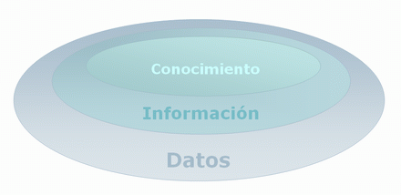

# Inteligencia de negocios

Business Intelligence es la habilidad para transformar los datos en información, y la información en conocimiento, de forma que se pueda el proceso de toma de decisiones en los negocios.



## Historia y antecedentes


Dividamos el marco temporal en **cuatro etapas**:

**70´s**

Durante los 70 nacen los **sistemas de gestión de bases de datos** y comenzaron a desarrollar los **primeros modelos relacionales**. Los desarrollos para la ingesta de información son de acceso lento y difícil. La interacción con el usuario comienza a mejorar gracias a la interacción con el scroll.

**80´s**

Aparecen los **primeros PCs** y esto es una verdadera revolución industrial. Se populariza el **uso de las bases de datos**, se **estandariza el lenguaje SQL**.

Los usuarios finales comienzan a sonreír gracias a la aparición de **gráficas e interfaces orientadas a usuarios**.

**90´s**

Nos encontramos con demasiada **información descentralizada y no conectada entre sí** pero en esta década se estandariza la correcta integración de los datos y aparecen las **BBDD distribuidas** gracias a la arquitectura cliente/servidor.

Es la década del **Business Intelligence 1.0**. Aparecen múltiples aplicaciones de BI todavía incapaces de analizar grandes volúmenes de datos en un tiempo aceptable y con limitaciones importantes como un número limitado de fuentes de datos y un precio "inalcanzable". Queda claro que el BI aún no era accesible para todas las empresas.

**2000´s**

Increíble, llegó el boom aéreo y podemos viajar por 25 euros a Londres, pero no es lo único importante, dos conceptos son los que marcan esta etapa **BI2.0** y **Social BI**, además aparece el **SW dedicado a BI**.

* **BI 2.0**: capacidad de los propios usuarios finales de generar contenido y compartirlo. Desde las mismas herramientas de análisis se toman decisiones, se ejecutan, se monitorizan y se vuelven a analizar resultados para empezar con una nueva decisión.
* **Social BI**: capacidad de integrar datos externos a nuestros sistemas, cruzando información con datos del mundo real que proviene de las redes sociales; pudiendo entender mejor el mercado que hay fuera y ver que vamos en línea al mismo.

Existe capacidad de almacenamiento masivo, alta velocidad de respuesta y modularización de la información.

En la actualidad, nos encontramos con múltiples formas de diseñar **soluciones de Business Intelligence**.

## Conceptos básicos

### Data Warehouse

Un Data Warehouse o "Almacén de datos" son depósitos (o archivos) de información reunida de varios orígenes, almacenada bajo un esquema unificado en un solo sitio.

Una vez reunida, los datos se almacenan por mucho tiempo, lo que permite el acceso a datos históricos.


### Data Mart

Un Data Mart, es una base de datos departamental, especializada en el almacenamiento de los datos de un área de negocio específica.

Se caracteriza por disponer la estructura óptima de datos para analizar la información al detalle desde todas las perspectivas que afectan a los procesos de dicho departamento.

Un Data Mart puede ser alimentado desde un Data Warehouse o integrar por sí mismo un compendio de distintas fuentes de información.


### Tipos de sistemas de información

Los Sistemas de Información que logran la automatización de procesos operativos dentro de una organización, son llamados Sistemas Transaccionales, ya que su función primordial consiste en procesar transacciones tales como pagos, cobros, pólizas, entradas, salidas.

Los Sistemas de Información  que apoyan el proceso de toma de decisiones son:

* Sistemas de Soporte a la Toma de Decisiones.

* Sistemas para la Toma de Decisión de Grupo.

* Sistemas Expertos de Soporte a la Toma de Decisiones.

* Sistema de Información para Ejecutivos.

El tercer tipo de sistema, de acuerdo con su uso u objetivos que cumplen, es el de los Sistemas Estratégicos, los cuales se desarrollan en las organizaciones con el fin de lograr ventajas competitivas, a través del uso de la tecnología de información.

**Sistemas Transaccionales**. Sus principales características son:

* A través de éstos suelen lograrse ahorros significativos de mano de obra, debido a que automatizan tareas operativas de la organización.

* Con frecuencia son el primer tipo de Sistemas de Información que se implanta en las organizaciones. Se empieza apoyando las tareas a nivel operativo de la organización.

* Son intensivos en entrada y salid de información; sus cálculos y procesos suelen ser simples y poco sofisticados.

* Tienen la propiedad de ser recolectores de información, es decir, a través de estos sistemas se cargan las grandes bases de información para su explotación posterior.

* Son fáciles de justificar ante la dirección general, ya que sus beneficios son visibles y palpables.

**Sistemas de Apoyo de las Decisiones**. Las principales características de estos son:

* Suelen introducirse después de haber implantado los Sistemas Transaccionales más relevantes de la empresa, ya que estos últimos constituyen su plataforma de información.

* La información que generan sirve de apoyo a los mandos intermedios y a la alta administración en el proceso de toma de decisiones.

* Suelen ser intensivos en cálculos y escasos en entradas y salidas de información.

* No suelen ahorrar mano de obra. Debido a ello, la justificación económica para el desarrollo de estos sistemas es difícil, ya que no se conocen los ingresos del proyecto de inversión.

* Suelen ser Sistemas de Información interactivos y amigables, con altos estándares de diseño gráfico y visual, ya que están dirigidos al usuario final.

* Apoyan la toma de decisiones que, por su misma naturaleza son repetitivos y de decisiones no estructuradas que no suelen repetirse.

* Estos sistemas pueden ser desarrollados directamente por el usuario final sin la participación operativa de los analistas y programadores del área de informática.

**Sistemas Estratégicos**. Sus principales características son:

* Su función primordial no es apoyar la automatización de procesos operativos ni proporcionar información para apoyar la toma de decisiones.

* Suelen desarrollarse “in house”, es decir, dentro de la organización, por lo tanto no pueden adaptarse fácilmente a paquetes disponibles en el mercado.

* Típicamente su forma de desarrollo es a base de incrementos y a través de su evolución dentro de la organización. Se inicia con un proceso o función en particular y a partir de ahí se van agregando nuevas funciones o procesos.

* Su función es lograr ventajas que los competidores no posean, tales como ventajas en costos y servicios diferenciados con clientes y proveedores. En este contexto, los Sistema Estratégicos son creadores de barreras de entrada al negocio.

* Apoyan el proceso de innovación de productos y proceso dentro de la empresa debido a que buscan ventajas respecto a los competidores y una forma de hacerlo en innovando o creando productos y procesos.

### Variables de medición

Las variables de medición son aquellas que representan la medición matemática de un aspecto del negocio.

Se utilizan para medir la productividad, las perdidas, las ganancias, entre otros aspectos que les pueden definir un sin número de indicadores que le permitirá a un ejecutivo tomar decisiones operativas o estratégicas.

Un ejemplo práctico es que si una empresa vende refrescos las variables de medición le ayudan a saber y a poder graficar cuantos refrescos se venden al día, cual es el más consumido, a qué tipo de personas les gusta el refresco, entre otras cosas se pueden aplicar las variables de medición.


### Variables de análisis

Las variables de análisis son aquellas que se incluyen en el proceso estadístico, son aquellas variables que realizan estudios analíticos sobre las variables de medición.

Las variables de análisis se utilizan principalmente para realizar estudios estadísticos como factores de riesgo, pre valencia del producto en el mercado, entre otras cosas.

Un ejemplo práctico es que se utilizan dentro de la empresa para poder determinar los diversos riesgos, la pre valencia del producto o el servicio dentro del mercado, local, nacional e internacional y también se obtienen fortalezas y debilidades de la empresa.


## Componentes básicos de la inteligencia de negocios

### Minería de Datos

La minería de datos o exploración de datos es un campo de la estadística y las ciencias de la computación referido al proceso que intenta descubrir patrones en grandes volúmenes de conjuntos de datos.​ Utiliza los métodos de la inteligencia artificial, aprendizaje automático, estadística y sistemas de bases de datos.

### Administración del Conocimiento

La administración del conocimiento implica la conversión del conocimiento tácito (el que sabe un trabajador específico) en explícito (conocimiento documentado y replicable) para convertirlo en un activo estratégico de la organización.

Dicho en otras palabras implica la adecuada utilización de datos e información para transformarlos en conocimiento y entendimiento.

### Aplicaciones Analíticas

1. **Características de las aplicaciones analíticas**.

Una aplicación analítica no es solo un juego de informes creados al azar. Tiene cuatro características importantes las cuales son:

1. **Integradas lógicamente**: significa que algún grado de lógica comercial es incluido en la aplicación que ayude a los usuarios a navegar a través de una serie de tareas.

2. **Informes Interactivos que permitan a los usuarios acceder, analizar y actuar**: Esto significa que los usuarios pueden penetrar con una vista de nivel más alto de un reporte a niveles más bajos o inferiores para adicionar información.

3. **Información Integrada**: Arquitectónicamente una aplicación analítica es un objeto soportado por un repositorio de almacenamiento de datos de la empresa.

4. **Dirección de un dominio comercial**: Las aplicaciones analíticas son definidas por los requerimientos de información de la actividad comercial, como las ventas, servicios o infraestructura.

2. **Elementos de una aplicación analítica**.

Una aplicación analítica está compuesta por seis elementos primordiales los cuales son:

1. **Visualización y percepción**: La visualización consiste en un ambiente grafico amigable al usuario, en la referente a la percepción se enfatiza en la navegación de las áreas de trabajo.

2. **Reportes y Análisis**: Los reportes en vistas de información predefinidas, que pueden presentarse como estáticas o como documentos interactivos, el análisis incorpora sofisticados cálculos, algoritmos estadísticos, y visualizaciones avanzadas para analizar grandes y complejos volumen de información.

3. **El servidor de análisis**: es generalmente el responsable de procesar peticiones utilizando run-time de metadatos definidos y guardándolos en el almacén del servidor.

4. **Lógica de negocios**: Ya se ha mencionado un tipo de lógica comercial, las reglas de navegación de los usuarios es paso a paso a través de reportes, vistas, acciones.

5. **Modelo de Datos**: es el cerebro de aplicaciones analíticas, a menudo trabajando en conjunto con la capa semántica de BI, los modelos de datos son usados en las definiciones de los cubos de OLAP.

6. **El mapeo de las fuentes**: Se definen las transformaciones requeridas para llevar los datos fuentes dentro del modelo de datos designado.

3. Dashboards y Scorecards

Los scorecards y dashboards proporcionan la información del rendimiento empresarial a través de sus distintas áreas.

La popularidad de dashboard está creciendo porque proporciona una interfaz sumamente intuitiva para supervisar y analizar los datos, existen tres tipos de Dashboards los cuales son:

1. **Operacional**: Los usuarios pueden intervenir en los procesos y actividades comerciales para solucionar un problema o capitalizar una oportunidad.

2. **Táctico**: Mide el progreso y actuación de los departamentos o equipos del proyecto contra metas establecidas a través de un gerente.

3. **Estratégico**: Contiene la métrica que se empleará en la estrategia corporativa. Estos Dashboards son en forma de cascada donde en cada nivel y se tiene una versión diferente de métrica moldeada a su dominio comercial.

### Sistemas de Reportes

Los sistemas de reportes tienen como objetivo principal mostrar una visión general de la situación de la empresa. Consecuentemente, estos muestran la situación de las operaciones regulares de la empresa para que los directivos puedan controlar, organizar, planear y dirigir. Los reportes se pueden visualizar, exportar a otros formatos como PDF, HTML, XML, etc. y también se pueden imprimir en papel.

### Multidimensionalidad

La multidimensionalidad dentro de la inteligencia de negocios ayuda a representar los datos en forma cercana a la intuición del usuario y al mismo tiempo resolver problemas planteados en sistemas relacionales.

La información multidimensional se puede encontrar en hojas de calculo, bases de datos, etc. Es una herramienta de B.I. que es capaz de reunir información dispersa en toda la empresa e incluso en diferentes fuentes para así proporcionar a los departamentos la accesibilidad, poder y flexibilidad que necesitan para analizar la información. Por ejemplo, un pronóstico de ventas de un nuevo producto en varias regiones no está completo si no se toma en cuenta también el comportamiento histórico de las ventas de cada región y la forma en que la introducción de nuevos productos se ha desarrollado en cada región en cuestión.

### Data Warehouse

Las características de los data warehouse se representan en la siguiente gráfica:


## Herramientas principales de inteligencia de negocios y apoyo

Las herramientas de negocio son:

* Cuadro de mando integral también llamados Dashboard.

* Digital Dashboards o paneles de Control Digital - También conocidos como Business Intelligence Dashboards, o Dashboards Ejecutivos, Son resúmenes visuales de información del negocio, que muestran de una mirada la comprensión del global de las condiciones del negocio mediante métricas e Indicadores Clave de Desempeño (KPIs). Esta es una Herramienta de Inteligencia de Negocios muy popular desde hace unos pocos años.

* OLAP (Procesamiento Analítico en línea por sus siglas en Inglés) (incluido HOLAP, ROLAP and MOLAP)- Es la capacidad de algunos sistemas de soporte de decisiones gerenciales que permiten examinar de manera interactiva grandes volúmenes de información desde varias perspectivas.

* Aplicaciones de Informes, genera vistas de datos agregadas para mantener a la gerencia informada sobre el estado de su negocio.

* Minería de datos - Extracción de información de las bases de datos acerca del cosumidor, mediante la utilización de aplicaciones que pueden aislar e identificar patrones o tendencias del consumidor en un alto volumen de datos. Hay una gran variedad de técnicas de minería de datos que revelan distintos tipos de patrones. Algunas de las técnicas son métodos estadísticos (Particularmente Estadística de Negocios) y Redes Neurales como formas altamente avanzadas de análisis de datos.

# Toma de decisiones con apoyo de base de datos

## Base de datos multidimensionales

Las bases de datos multidimensionales (BDMB) son un tipo de base de datos optimizada para Data Warehouse que se utilizan principalmente para crear aplicaciones OLAP, una tecnología asociada al acceso y análisis de datos en línea.

## Sistemas de gestión de conocimiento

Son herramientas para llevar a cabo la gestión del conocimiento.

Están manifestados en una variedad de implementaciones:

* Repositorios de documentos.

* Bases de datos de experticia.

* Listas de discusión.

* Sistemas de recuperación específicos del contexto.

## Valor agregado al negocio por el uso de datos

Las organizaciones, independientemente de su tamaño y sector, requieren dotarse de soluciones que les permitan sacar el máximo provecho de su información, para ponerla a disposición de sus diversos tipos de usuarios y así apoyar la toma de decisiones. No hacerlo podría traerles lamentables consecuencias.

Business Intelligence hace posible que muchas preguntas de negocio sean resueltas rápidamente por los propios usuarios. Por ejemplo, si tenemos información periódica sobre las ventas realizadas, sobre el esfuerzo de nuestra red comercial y sobre los pedidos realizados a los proveedores, podemos cruzar toda esta información para analizar 

* ¿En qué zonas se está vendiendo más de cada familia de productos? 
* ¿Quiénes son nuestros clientes más rentables?
* ¿Cuál es la relación entre el esfuerzo comercial y las operaciones cerradas? 
* ¿De qué proveedores se está comprando la mayor parte de los productos vendidos? 

No se trata de analizar la información de un área de la empresa, sino que el objetivo es analizar toda la organización, abarcando cada uno de los ámbitos de la cadena de valor. Precisamente, los sistemas de Business Intelligence se basan en la integración y en la universalización de la información, para dar respuesta a las necesidades analíticas.

Producimos constantemente muchos datos en las organizaciones, pero quizás no tenemos la habilidad de convertirlos en información valiosa. Veamos algunos datos que se pueden tomar de un departamento y qué información se puede obtener.


## La administración de los catálogos maestros

Los sistemas de business intelligence se utilizan principalmente para mejorar la calidad en la toma de decisiones de una empresa. Sin embargo, si los datos incluidos en el data warehouse no tienen calidad, no son completos o tienen duplicidades, los informes extraídos con tu business intelligence, lo único que conseguirán es perjudicar a tu empresa.

Para que un data warehouse puede asegurar su inteligencia, es necesario que reciba el apoyo de un Master Data Management. De esta forma la empresa podrán desarrollar todo su potencial lo que permitirá que la empresa desarrolle el suyo.

Los datos maestros se pueden suministrar a las herramientas de integración de datos del sistema BI de al menos tres maneras:

* Mediante el uso de servicios de integración y emparejamiento de un software de calidad de datos habilitado para SOA para suministrar datos maestros directamente en un data warehouse o para procesos de ETL que alimentan data warehouses.

* Mediante el uso de una solución MDM para crear una fuente de datos virtual de datos maestros a la que puede acceder una herramienta de integración de datos del sistema de BI

* Utilizando un hub de datos MDM construido o comprado como una fuente de datos persistente para una herramienta de integración de datos del sistema de BI

En resumen, podría decirse que la gestión de datos maestros fortalece los sistemas Data warehouse / BI de las siguientes maneras:

* Proporcionando metadatos maestros para su uso en modelos de datos dimensionales y cubos

* Proporcionando datos maestros de alta calidad como fuente de datos de confianza para el procesamiento ETL

* Proporcionando vistas federadas de datos maestros a través de sistemas dispares para la generación de informes

* Seguimiento de versiones de jerarquías a través del tiempo

* Automatizando la recreación de diferentes versiones de una dimensión en un esquema de cubo o estrella para reflejar cambios en jerarquías

* Proporcionando datos confiables para la elaboración de informes y análisis

## La calidad de los datos

En mayor o menor medida, toda organización tiene problemas de calidad de la información que deben corregirse mediante una adecuada arquitectura de datos, que se lleve a cabo una mejora y actualización continuas, para que permitan su explotación con fines comerciales o para su uso en la toma de decisiones.

La calidad de los datos ha de alcanzar a todas las áreas de la empresa, y hacerlo a partir de unos requisitos mínimos establecidos en los orígenes. Gracias a una gestión de datos adaptada a las necesidades de la empresa conseguiremos preservar su calidad cuando éstos se propaguen en el seno de la organización.

Sin embargo, las necesidades de actualización y depuración de los datos no serán las mismas en todas las empresas ni, dentro de ellas, para todo tipo de actuaciones.

Los datos de calidad sometidos a constantes procesos de limpieza proporcionarán una información completa y actualizada y se revelan como imprescindibles para implementar una estrategia de análisis avanzado.

Llegados a este punto, los científicos de datos tendrán la misión de obtener valor de esta montaña de datos estructurados y desestructurados, a partir de los que obtener conocimiento, detectar tendencias y, en suma, extraer una información valiosa que puede resultar decisiva en el actual entorno competitivo.

Los sistemas BI de nueva generación han multiplicado sus posibilidades con respecto a los DW tradicionales, y ello indudablemente favorece la ventaja competitiva para cualquier empresa que pueda obtener rendimiento del masivo volumen de datos que se genera diariamente, a gran velocidad, procedente de distintas fuentes.

# ¿Qué es PHP?

PHP es un lenguaje de programación de propósito general de alto nivel que fue diseñado especialmente para el desarrollo de aplicaciones web.

Es interpretado, multiplataforma, open source, el cual ha sido muy popular en los últimos años.

## ¿Qué NO es PHP?

* No es un lenguaje compilado, por lo cual siempre tendrás que llevar juntos tu código y tu interprete.
* No esta diseñado para realizar aplicaciones de escritorio.

Para trabajar con PHP instalaremos un entorno de desarrollo llamado XAMPP, no es un entorno pensado para producción.

# Sintaxis de PHP

Hagamos el ejemplo más sencillo para trabajar con PHP. Siempre que usemos PHP usaremos lo siguiente: todo lo que pongamos dentro de esto será lo que el servidor va a interpretar como código php, lo que esté fuera lo ignorará.

Para acceder a él lo haremos localhost:8080/hello.php porque el servidor abre por defecto el archivo index y nuestro nuevo archivo se llama hello.php.

Si queremos escribir código php en nuestra vista HTML tendremos que cambiarle la extensión al archivo por .php porque nuestro servidor esta configurado a solo interpretar archivos PHP. Solo las partes dentro de van a ser interpretadas y su código fuente no será visible desde el navegador.

Todas las sentencias de código se separarán con un ; (punto y coma).

# Variables, tipos de datos y cadenas

Una variable puede ser una pequeña cajita en la que puedes almacenar un valor y este lo pueden usar para realizar alguna operación.

Para declararla usaremos el símbolo de $ y en seguida el nombre, este puede ser un _ o una letra.

PHP no es estáticamente tipado, es decir que no tenemos que decirle qué tipo de dato es esa variable. Además, es débilmente tipado porque podemos fácilmente cambiar el tipo de dato, es decir PHP ejecuta una conversión de datos interna.

Al momento de trabajar con PHP una cosa muy importante es hacer debugging a nuestras variables, para ello utilizamos la función var_dump(); pasándole por parámetro la variable a revisar.

En PHP tenemos dos tipos de cadenas, las que son con comillas simples y las de comillas dobles. La diferencia entre estas dos cadenas es que la de comillas simples recibe de forma literal lo que le escribas mientras que la de comillas dobles intenta interpretar cualquier variable dentro de ella.

# Tipos de Datos en PHP

PHP cuenta con muchos tipos de datos, sin embargo, en este momento nos vamos a enfocar en los más importantes y utilizados que son boolean, integer, float, string, array y NULL.

## Tipos escalares:

* boolean:

Representa solamente un valor verdadero o falso. 
[http://php.net/manual/es/language.types.boolean.php](http://php.net/manual/es/language.types.boolean.php)
Valores válidos: true (verdadero) false (falso)

```
<?php
$a = true;
$b = false; 
?>
```

* Integer:

Representa un número entero positivo, negativo o 0. 
[http://php.net/manual/es/language.types.integer.php](http://php.net/manual/es/language.types.integer.php)

```
<?php
$a = -123;
$b = 0;
$c = 7763;
?>
```

* float o double:

Representa un número de punto flotante, existen problemas de precisión con los números flotantes debido a la naturaleza binaria de las computadoras. 
[http://php.net/manual/es/language.types.float.php](http://php.net/manual/es/language.types.float.php)

```
<?php
$a = 12.24; 
$b = 1.5e3; 
$c = 7E-10;
?>
```

* string:

– Representa una cadena de caracteres.
– Existen 4 formas de representar una cadena. Las 2 principales son usando comillas simples o comillas dobles.
---- Usando comillas simples donde el texto será exactamente como se escribe.
---- Usando comillas dobles permite usar caracteres de escape y además expanden los nombres de las variables, es decir sustituye el valor de las variables dentro de las cadenas.

– Hay 2 formas adicionales llamadas Heredoc y Nowdoc que sirven para crear cadenas de múltiples líneas.

Si quieres conocer más de este tipo de dato da [click aquí](http://php.net/manual/es/language.types.string.php#language.types.string.details).

## Tipos compuestos

* array:

Representa una colección de valores, aunque por defecto PHP usara índices numéricos, la realidad es que la estructura se representa como un mapa que colecciona pares llave-valor. La sintaxis para definir un arreglo será a partir de corchetes cuadrados, aunque en versiones anteriores de PHP era necesario usar la función array(). Las llaves pueden ser enteros o cadenas y los valores pueden ser de cualquier tipo de PHP, incluso de tipo array. 
[http://php.net/manual/es/language.types.array.php](http://php.net/manual/es/language.types.array.php)

```
<?php
$array = array(
    "curso1" => "php",
    "curso2" => "js",
);

// a partir de PHP 5.4
$array = [
    "curso1" => "php",
    "curso2" => "js",
];

// índices numéricos
$array = [
    "php",
    "js",
];
?>
```

* object:

Representa una instancia de una clase. Este tema lo vimos más a fondo en la clase de Programación Orientada a Objetos.

```
<?php
class Car
{
    function move()
    {
        echo "Going forward..."; 
    }
}

$myCar = new Car();
$myCar->move();
?>
```

* callable:
Es un tipo de dato especial que representa a algo que puede ser “llamado”, por ejemplo una función o un método.

```
<?php
// Variable que guarda un callable
$firstOfArray = function(array $array) {
    if (count($array) == 0) { return null; }
    return $array[0];
};

// Este es nuestro arreglo
$values = [3, 2, 1];

// Usamos nuestro callable y se imprime el valor 3
echo $firstOfArray($values);
?>
```

* iterable:

A partir de PHP 7.1 iterable es un pseudo tipo de datos que puede ser recorrido.

```
<?php

function foo(iterable $iterable) {
    foreach ($iterable as $valor) {
        // ...
    } 
}

?>
```

## Tipos especiales

* resource:

Es un tipo de dato especial que representa un recurso externo, por ejemplo un archivo externo a tu aplicación.

```
<?php
$res = fopen("c:\\dir\\file.txt", "r");
?>
```

* NULL:

Es un valor especial que se usa para representar una variable sin valor. 
[http://php.net/manual/es/language.types.null.php](http://php.net/manual/es/language.types.null.php)

```
<?php
$a = null; 
?>
```

# Arreglos

Como vimos en la clase anterior almacenamos datos en una variable, ahora trataremos de almacenar más datos en una misma variable.

Estas variables que almacenan más de un dato se conocen como arreglos y su sintaxis se va a indicar con corchetes.

PHP utiliza índices para localizar a los elementos dentro de la variable.

La estructura de arreglos en PHP es conocida como mapa, lo que quiere decir que tiene una composición de llave valor. Además, un arreglo puede contener más arreglos y cada uno de ellos seguirá la misma estructura.

Algo que debes saber es que en PHP podrás almacenar diferentes tipos de datos en un mismo arreglo.

# Condicionales

Las condiciones nos permiten tomar decisiones en el código, si se cumple la condición entonces se ejecutarán ciertas instrucciones sino se cumple se ejecutarán otras. Estas se denotan por la instrucción if else.

```
$var1 = 1;

if($var1 > 0) {
  echo'es mayor que 2';
} 
else {
  echo'no es mayor que 2';
}
```

# Ciclos

Los ciclos o bucles son de total importancia cuando desarrollamos software pues nos permiten repetir un bloque de acciones y en consecuencia re-utilizar mejor nuestro código.

Funcionan de la mano con las condiciones, en este caso si se cumple la instrucción se estará ejecutando repetidas veces una instrucción dada.

## Do while

```
$idx = 0;
do {
  echo $idx;
  $idx++;
} while($idx < 3);
```

El ciclo do while garantiza que el código interno se ejecutará al menos 1 vez.

## While

```
$idx = 0;
while ($idx < 3) {
 echo $idx;
 $idx++;
}
```

En el ciclo while si la condición es falsa desde un inicio, es posible que el ciclo nunca se ejecute.

## For

```
for($idx = 0; $idx < 3; $idx++) {
  echo $idx;
}
```

## Foreach

El ciclo foreach nos brinda una solución simple para iterar sobre los valores de un arreglo, la sintaxis es la siguiente:

```
$array = ['uno', 'dos', 'tres']
foreach ($array as $valor) {
  echo $valor;
}
```

En esta sintaxis nos encontramos con 4 partes:

* La palabra reservada foreach simplemente indica el inicio de nuestro bloque.
* Dentro de paréntesis se escribe el nombre del arreglo que vamos a estar iterando, este arreglo debe estar definido previamente, en este ejemplo es $arreglo.
* La palabra "as" seguido de un nombre de variable que usaremos para acceder al elemento del arreglo que estamos accediendo, esta variable no debe existir previamente y solo la podrán usar dentro de este bloque. En el ejemplo es $valor.
* Entre llaves "{ }" están todas las acciones que queremos repetir, en el momento en que se ejecute el ciclo la variable que definimos para iterar (en el ejemplo $valor) ya existe y podrá ser usada en esta sección, piensa que el valor de esta variable estará cambiando en cada iteración.

Suponiendo que en el ejemplo anterior, el ciclo se repetirá 3 veces y en cada iteración la variable $valor contendrá el elemento del arreglo correspondiente, es decir, en la primera iteración $valor será igual a ‘uno’, en la segunda $valor será igual a ‘dos’ y en la tercera $valor será igual a ‘tres’.

Existe una sintaxis alternativa que nos permite no solo conocer el valor, también nos permitirá conocer la llave, de este modo tendremos acceso tanto a la llave como al valor del elemento del arreglo:

```
foreach ($array as $llave => $valor) {
  //sentencias que pueden usar $llave y $valor
}
```

# Formularios

Los formularios nos permiten enviar datos desde el cliente (navegador) al servidor, procesarlos y almacenar esa información en una base de datos.

Vamos ahora a construir un formulario con HTML y veremos cada detalle del mismo.

Podemos enviar información desde un formulario a través de diferentes métodos, GET o POST. Para acceder a esta información desde PHP llamaremos a `$_GET` y `$_POST`, estas son variables super globales.

Recuerda que para hacer debugging de una variable usamos la función var_dump.

# Enviando datos por el método POST

Utiliza el método POST cuando se requiere una operación que implique alguna modificación, esto puede ser agregar, editar o eliminar un registro de la base de datos, enviar un correo electrónico al usuario, etc.

# Enviando datos por el método GET

Recibe toda la información por la URL del navegador, el usuario podría modificar manualmente la información desde esa misma URL, se utiliza mayormente cuando queremos consultar información y mostrarla en el navegador.

# Enviando datos a la misma página

1. Dejar en blanco el atributo action

2. Poner en el atributo action el mismo nombre del archivo

3. Usar la variable `$_SERVER['PHP_SELF']` (opción recomendada)

# Comprobando si un formulario ha sido enviado

1. Usando la variable `$_SERVER['REQUEST_METHOD']` (opción recomendada si solamente usas un formulario en tu vista)

2. Con ayuda de la función `isset()` para comprobar de que formulario se envian los datos.

# Validando un formulario

Es importante validar los datos de tu formulario ya que asegura la integridad de tu base de datos.

Validar los datos no solamente implica hacerlo del lado del backend, tenemos que hacerlo de igual manera en el lado del frontend.

# Sesiones

Las sesiones nos van a permitir hacer inicio de sesión en nuestra aplicación web y usar variables que podemos utilizar en diferentes páginas y mantener sus valores en cada una de ellas.

En cada página que vayamos a utilizar sesiones tenemos que utilizar la función `session_start()`. La variable `$_SESSION` funciona como un arreglo asociativo en la que podemos ir agregando elementos a nuestro arreglo y así utilizar esos elementos en diferentes páginas.

# Conectandonos a una base de datos MySQL mediante PDO

La libreria PDO nos permite conectarnos a diferentes bases de datos como SQL Server, PostgreSQL, SQLite, MySQL, etc.

# Ejecutando consultas MySQL mediante el método Query

El método `query()` nos permite ejecutar consultas MySQL para extraer información desde nuestra base de datos. Se recomienda utilizar el método `query()` para ejecutar consultas sencillas que no impliquen la busqueda de datos por parte del usuario, ya que si utilizamos este método para consultas más elaboradas nos podrían inyectar código con un poquito de conocimientos sobre el tema.

# Consultas Preparadas (Prepared Statements)

Las consultas preparadas nos permiten tener consultas más elaboradas que impliquen busqueda de datos por parte del usuario.

# Creando un Inicio de Sesión y Registro de Usuarios

Haremos una práctica en la que vamos a crear tres vistas:

* Login
* Registro de usuarios
* Contenido de una página (Acceso restringido)

## Creando la Estructura Base y Contenido a Proteger

Para iniciar nuestra práctica vamos a crear una carpeta login_registro en donde estarán todos nuestros archivos relacionados a la misma práctica.

Una buena práctica es mantener separada la lógica de negocios de la aplicación con la vistas. Para ello vamos a crear cada vista en un archivo y su lógica (controlador) en otro.

Vamos a mantener nuestras vistas dentro de una carpeta views y los controladores dentro de la raíz de la carpeta login_registro.

## Creando el Index y Preparando la Página de Registro

El archivo index.php es la página principal que se ejecutará al momento de acceder a nuestra aplicación.

Vamos a crear el index.php dentro de la raíz de la carpeta login_registro.

Este archivo tendrá una comprobación: Validar si el usuario tiene una sesión iniciada, si es así le redirige al contenido.php y si no lo manda a la página de registro de usuarios.

## Creando el formulario de Registro

El formulario de registro tendrá 3 campos:

* Usuario
* Contraseña
* Confirmar contraseña

> Recuerden que es importante que cada campo del formulario tenga el atributo `name` para asegurar que ese campo junto con su valor sea enviado al servidor.

## Creando la vista del Formulario de Login

El login tendrá 2 campos:

* Usuario
* Contraseña

## Recibiendo los datos del formulario de registro

Ahora nos encargaremos de la lógica de negocios para registrar un usuario. Por lo tanto tenemos que usar el método `post` ya que haremos operaciones con nuestra base de datos, es decir, vamos a agregar un registro a nuestra tabla `usuarios`.

Lo primero que tenemos que hacer es comprobar si el formulario a sido enviado, como ya habiamos visto eso lo hacemos con ayuda de la superglobal `$_SERVER['REQUEST_METHOD']`.

Y posteriormente procederemos a obtener los datos del formulario de registro.

## Validando los datos del formulario de registro

En cada formulario de nuestra aplicación es muy importante validar los campos, ya que esto asegura tener datos correctos en nuestra base de datos.

Cada formulario se validará de manera diferente dependiendo del número de campos que tenga, y cada campo tendrá sus validaciones correspondientes.

Para el campo usuario tenemos las siguientes validaciones:

1. El campo es obligatorio, por lo tanto no debe ir vacio.

2. El campo tiene que estar en minusculas.

3. El campo no debe contener ningún carácter especial solamente letras y números.

4. El campo debe ser único, es decir, no puede haber dos usuarios iguales en la base de datos.

Para el campo password tenemos las siguientes validaciones:

1. El campo es obligatorio, por lo tanto no debe ir vacio.

2. El campo debe coincidir con el campo de confirmar contraseña.

Para el campo confirmar_password tenemos las siguientes validaciones:

1. El campo es obligatorio, por lo tanto no debe ir vacio.

2. El campo debe coincidir con el campo de contraseña.

Una vez validados cada campo sin generar ningún error procederemos a guardar el usuario en la base de datos.

En caso de generar un error al momento de validar un campo, tenemos que mostrar esos errores al usuario para que proceda a corregirlos.

## Validando la Contraseña y Encriptandola

Como mencionamos una de las validaciones que debe tener el campo `password` es que coincida con el campo `confirmar_password`. Esto lo hacemos en una condición comparando el valor de ambos campos. Luego de que se cumpla con esta validación procederemos a encriptar la contraseña con la función `password_hash()`.

> Las contraseñas no deben guardarse en la base de datos en texto plano, ya que esto implica un riesgo de seguridad. Ya que en caso de robo de información, el atacante podría ver la contraseña tal cual fue escrita.

## Creando la Lógica del Formulario de Inicio de Sesión

Lo primero que tenemos que comprobar es si el usuario tiene una sesión iniciada, en caso de tener una sesión mandamos al index.

Si se dan cuenta tenemos las mismas líneas de código en los archivos `contenido.php`, `registrate.php` y `login.php` en donde comprobamos si el usuario tiene una sesión. La manera en la que podemos refactorizar esto es creando una función, para que no pongamos las mismas líneas de código en estos archivos, y solamente mandemos a llamar a nuestra función.

> Podemos crear un archivo `funciones.php` en la que engloben todas las funciones que necesitamos en la aplicación.

Ahora una ves hecho esto, recuerden que tenemos que comprobar si el formulario ha sido enviado a través del método post, luego obtener los datos del formulario.

Tenemos que conectarnos a nuestra base de datos para realizar una consulta en donde buscamos el usuario que nos pasaron a través del formulario.

Aquí si se dan cuenta podemos de igual manera refactorizar nuestro código en la conexión de la base de datos.

Si la consulta devuelve `false` quiere decir que el usuario no existe dentro de la base de datos, en caso de existir ahora tenemos que verificar si la contraseña es correcta a través de la función `password_verify()`.

Ahora si paso las dos comprobaciones inicializamos nuestras variables de sesión y redirigimos al usuario al `contenido.php`. 

## Protegiendo el Contenido y Cerrando Sesión

Como ya mencionamos tenemos que validar si un usuario tiene una sesión iniciada para que pueda acceder al Contenido, ya que se trata de un contenido restringido.

Ya tenemos una sesión, ahora veremos como cerrar esa sesión. Vamos a crear un archivo `cerrar.php` en la raíz de la carpeta `login_registro`.

# Bases de Datos en PHP

* Introducción

* MySQL

* Conexión a la BD

* Crear y eliminar tablas

* Práctica

# ¿Qué es una base de datos?

* Es un almacén que nos permite guardar grandes cantidades de datos de una manera organizada.

* Está conformada por tablas.

Un buen análisis de la estructura de la base de datos define el éxito de una aplicación.

# Ventajas y Desventajas

## Ventajas

* Control sobre la redundancia de datos

* Consistencia de los datos

* Accesibilidad

* Seguridad

* Información altamente organizada

## Desventajas

* Mal manejo de los tipos de datos

* Mal diseño de nuestras tablas

* Duplicidad

* Sin relación en los datos

# ¿Qué es MySQL?

* Es un sistema de gestión de BD relacional, multihilo y multiusuarios.

* Código abierto más popular junto a Oracle y Microsoft Server.

* Relacional. Las tablas se encuentran unidas por atributos que compone cada tabla.
* Multiusuarios. Más de un usuario conectado de manera simultánea
* Multihilos. Podemos realizar varias peticiones hacia la BD de manera simultánea.

* Múltiples motores de almacenamiento: MyISAM, Falcon, Merge, InnoDB, Archive.

# MyISAM vs InnoDB

* MyISAM los guarda en el orden en que fueron almacenados
* InnoDB almacena físicamente los registros en el orden de la clave primaria.
* InnoDB no dispone de compresión de datos como se tiene en MyISAM
* InnoDB soporte de transacciones, garantiza la integridad de nuestras tablas

# ¿Qué es un sistema control de versiones?

Un sistema que registra los cambios realizados sobre un archivo o conjunto de archivos a lo largo del tiempo.

## Tipos de sistemas de control de versiones

* Local: Vive en nuestra computadora. Si le ocurre una catástrofe vamos a perder nuestro trabajo.


* Centralizado: Depende de un servidor donde está almacenado el repositorio.


* Distribuido: Cada participante del repositorio tiene una copia local y no afecta el trabajo del resto. No perderemos nuestro trabajo si nuestro computadora se daña, simplemente pedimos una copia a cualquier servidor donde esté almacenada la copia.


Git es un Sistema de Control de Versiones Distribuido.

# Configuración

Lo primero que debemos hacer justo después de instalar git es decirle quienes somos, esto lo hacemos proporcionándole a git nuestro nombre y correo electrónico, lo cual podemos hacerlo con los siguientes comandos

```
# Indicar nuestro nombre
git config --global user.name "Nuestro Nombre"

# Indicar nuestro correo electrónico
git config --global user.email "nuestro@correo.com"
```

# Repositorio local

Para inicializar un repositorio primero debemos crear un directorio donde vamos a almacenar nuestro proyecto, luego en la consola nos dirigimos a el y una vez dentro ejecutamos

```
git init
```

Una vez que estemos trabajando con el código podremos ver el estatus de nuestro proyecto con el comando

```
git status
```

Para añadir archivos al stage y poder rastrear los cambios que se hayan tenido sobre ellos ejecutamos

```
# Para añadir un solo archivo
git add nombre_del_archivo

# Para añadir todo lo que hay en el directorio actual
git add --all
# o bien
git add .
```

Por último creamos un commit, los commits deben ir siempre con un mensaje el cuál pasamos con el parámetro -m como se muestra a continuación:

```
git commit -m 'Primer commit'
```

Mostrar el historial, en ocasiones vamos a querer ver todas las consolidaciones (commits) que tengamos en nuestro historial.

```
git log
```

En ocasiones va a ser necesario que eliminemos un commit, ya sea porque hicimos un commit y queremos volver a como estábamos anteriormente lo cual podemos hacerlo de la siguiente manera

```
# Soft reset dejará todo lo que tenía nuestro último commit en stage
git reset --soft IDENTIFICADOR_DEL_COMMIT

# Hard reset eliminará el commit junto con todos sus cambios
# y no podrán ser accesibles de nuevo
git reset --hard IDENTIFICADOR_DEL_COMMIT
```

NOTA: Es muy importante que si van a hacer algún reset lo hagan antes de enviar los cambios al repositorio remoto.

# Trabajando con servidores remotos en Git

Al estar trabajando con git es muy común que queramos almacenar nuestro código en algún servidor remoto, y existen muchas razones para eso, ya sea sólo por seguridad, por si nuestra computadora se daña podamos evitar la pérdida del código, o incluso por si estamos trabajando de manera colaborativa, que de hecho esta es la razón más común para utilizar un servidor remoto. Estos servidores se encargan de almacenar nuestro código junto con el historial, de la misma manera que lo tenemos en nuestra computadora local, teniendo así todo el repositorio disponible para cuando lo necesitemos.

Los servidores más comunes para esto son GitHub, Bitbucket y GitLab, sin embargo también podemos utilizar servidores privados para poder administrarlos nosotros mismos como el caso de GitLab.

Para crear un remoto debemos indicar un comando como éste:

```
git remote add origin git@github.com:usuario/repositorio.git
```

Luego tendremos que subir los cambios que tenemos en nuestro repositorio local al remoto:

```
git push -u origin master
```

Cuando estamos trabajando con Git podemos hacerlo en tantos equipos como queramos por lo que si estamos en una oficina y subimos cambios a GitHub podemos descargarlos en cualquier lado, supongamos que decidimos seguir trabajando desde casa, si queremos descargar los cambios que hicimos durante el día, nos dirigimos de nuevo al root del proyecto en la terminal y tecleamos lo siguiente:

```
git pull
```

Esto descargará todos los cambios que hayamos realizado en nuestro equipo local.

Nota: Para poder hacer esto es necesario que ambos equipos tengan registrados el mismo remoto para poder utilizar el repositorio.

# Trabajando con diferentes ramas (branches) en Git

Un branch es una copia exacta del repositorio en el que podemos trabajar sin comprometer el flujo principal (branch master) y veremos cómo podemos lograrlo.

## Clonar un repositorio

Para clonar nuestro repositorio debemos ir a la terminal y teclear.

```
git clone git@github.com:usuario/repositorio.git
```

Esto hará una copia fiel del proyecto, junto con todo el historial de cambios que ha tenido en nuestra computadora local, sin embargo aún no está listo para trabajar ya que primero (en el caso de Laravel) debemos instalar las dependencias de composer.

```
composer install
```

Esto nos va a generar el directorio vendor con todo lo que el framework necesita, además debemos generar nuestro archivo .env a partir del archivo de ejemplo que viene con el framework.

Y una vez que lo tengamos debemos indicar nuestras credenciales siendo los más comunes los de la base de datos:

```
DB_DATABASE=nombre_de_la_bd
DB_USERNAME=usuario_de_la_bd
DB_PASSWORD=password_de_la_bd
```

Y por último generamos la llave del proyecto:

```
php artisan key:generate
```

## Crear branches (ramas)

Ya que tengamos nuestro repositorio trabajando es necesario que creemos una rama para empezar a desarrollar los features que el proyecto necesite, para crear los branch existen dos maneras:

```
# Crear un branch
git branch nombre_del_branch
# Posicionarnos en el branch
git checkout nombre_del_branch

# O bien podemos hacer todo en un solo comando
git checkout -b nombre_del_branch
```

Una vez que estemos seguros que el código funciona y que haya pasado todas las pruebas (en caso de estarlas utilizando) debemos incorporar los cambios al flujo principal del proyecto, nuestra rama master.

```
# Primero nos posicionamos en master
git checkout master

# Luego unimos la rama en la que estábamos trabajando
git merge nombre_de_la_rama

# Por último eliminamos la rama que ha sudo unida
git branch -d nombre_de_la_rama
```